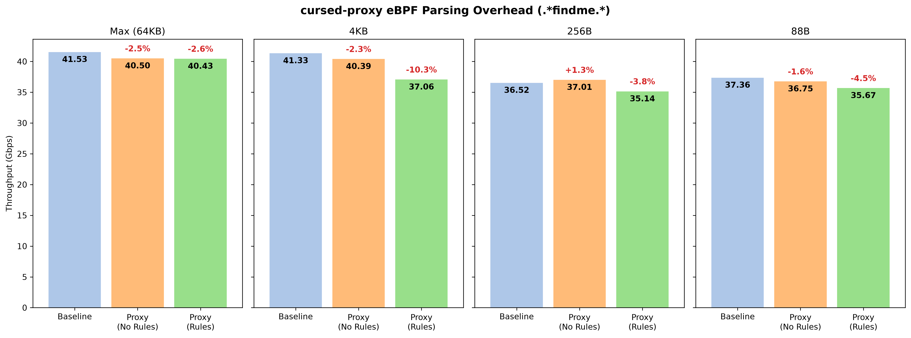

# cursed-proxy
A highly cursed, eBPF-based TCP proxy using Deterministic Finite Automata, meant for Attack & Defense CTF competitions and other buzzwords.

Instead of routing packets to userspace like a normal A&D proxy, cursed-proxy compiles your regex rules into a DFA state machine and loads them directly into the kernel. By injecting an eBPF program at the Traffic Control layer, incoming packets are evaluated before they ever touch the standard kernel TCP stack. Operating below the TCP stack and parsing its own headers makes this proxy extremely fast, bypassing userspace overhead entirely. This also has the nice side effect of making the proxy completely transparent and without requiring any application configuration or routing changes for the target service.

The proxy can send a RST packet by dynamically rewriting the incomming packet and reversing the direction, this means that no space needs to be allocated for the new packet.

## Performance
One of the motivations about writing this proxy was to see how performant and usable a proxy like this could be, so here a few stats.



As the graph shows, running directly in the kernel at the Traffic Control layer allows the proxy to evaluate and filter packets with virtually zero overhead. This keeps the latency nearly identical to a direct connection, completely bypassing the bottlenecks of routing packets through userspace.

## Why?
Honestly? I really needed an excuse to learn how eBPF filters work, and I needed an excuse to write a TCP proxy too. This is still a fun side-project and definitely not production-tested, so use it carefully!

## TODOs
* [ ] Handle fragmented packets correctly (right now, if a payload is split across two packets like `[GET /a][dmin]`, the DFA resets and it slips through)
* [ ] More regex for the same ports could be fused together
* [x] Forge reset packet to stop connection
* [x] Move to the traffic control layer, this makes forging packets and reading in place possible. 
* [x] Change DFA compiler for faster parsing.
* [x] Integrate libcursed_proxy logging into python logging.

## How to use it

### Requirements
* Linux Kernel v6.4+ (with BTF enabled, most are nowadays)
* Python 3.8+

### Configuration

Create a plain text config file (like `proxy.conf`). Each line maps a listening port to a regex string you want to ban.

```text
# proxy.conf
# Format: <PORT>: <REGEX>

1234: .*dropme.*
8080: GET /admin.*
```

> **Note on Regex Rules:** 
> `cursed-proxy` uses `interegular` to compile your regex into a DFA.
> * **Supported Syntax:** Standard formal regex features work perfectly. You can use `.` (any char), `*` (0 or more), `+` (1 or more), `?` (0 or 1), `|` (OR), `()` (Grouping), character classes like `[a-zA-Z]` or `\d`, and quantifiers like `a{1,3}`.
> * **Unsupported Syntax:** non-regular features like backreferences (e.g., `\1`), conditional matching, and lookarounds are **not** supported.
> 
> The eBPF kernel program evaluates rules starting from the very first byte of the TCP payload. This means a rule like `GET /admin.*` automatically acts as a "starts-with" rule. If you want to match a string anywhere inside the payload, you must explicitly prefix it with `.*` (e.g., `.*dropme.*`).

### Running the Proxy
```bash
git clone https://github.com/0xUb1k/CursedProxy.git
cd CursedProxy

# Using uv
sudo uv run cursed-proxy -c proxy.conf

# Using pip
pip install .
sudo cursed-proxy -c proxy.conf
```
*(If you don't trust my `.so` file, you can easily compile it from source. See the section at the bottom).*

The proxy watches `proxy.conf` in the background. If you edit and save the file, it will instantly compile the new regex.

---

## Building from Source
```bash
#Ubuntu / Debian
sudo apt update
sudo apt install clang llvm make gcc libbpf-dev libelf-dev zlib1g-dev bpftool

#Arch Linux
sudo pacman -S clang llvm make gcc libbpf libelf zlib bpf

#To build
make clean
make
